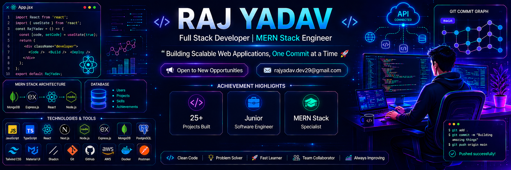

 <!-- 

<h1 align="center"></h1> -->

<!-- Row 2: About Me Section -->
<table width="100%" border="0" cellpadding="0" cellspacing="0">
  <tr>
    <td width="55%" valign="top">
      <h3>👤 About Me:</h3>
      <ul>
        <li>🌱 I'm currently learning <b>Java and DSA from Apna College</b> <a href="https://github.com/Rajyadav2912/Alpha-3.0_Java_with_DSA" target="_blank">🔗</a></li>
        <li>🚀 My Latest Project is <a href="https://raj-portfolio-29.netlify.app/" target="_blank">🔗</a></li>
        <li>🛍️ Design an E-commerce Shopping Website <a href="https://e-commerce-shopping-website-29.netlify.app" target="_blank">🔗</a></li>
        <li>📱 Contact App Using CRUD <a href="https://contact-app-crud.vercel.app/" target="_blank">🔗</a></li>
        <li>🧑‍💻 All of my projects are available at <a href="https://rajyadav2912.github.io/Raj_Portfolio_2920" target="_blank">🔗</a></li>
        <li>📄 Know about my experiences <a href="https://drive.google.com/file/d/1ogExUr8iNERb639N2uY3KZ-5K5vJ8jC_/view?usp=sharing" target="_blank">🔗</a></li>
        <li>🤝 I'm looking for help with</li>
        <li>💬 Ask me about</li>
      </ul>
    </td>
    <!-- <td width="45%" valign="middle" align="right">
      
    </td> -->
  </tr>
</table>

 

<!-- Row 3: Socials & Tech Stack Side-by-Side -->
<table width="100%" border="0" cellpadding="0" cellspacing="0">
  <tr>
    <!-- Socials Card -->
    <td width="38%" valign="top">
      <h3>🌐 Socials:</h3>
      

        
      

      

        
      

      

        
      

      

        
      

      

        
      

      

        
      

    </td>
    <!-- Tech Stack Card -->
    <td width="62%" valign="top" style="padding-left: 20px;">
      <h3>💻 Tech Stack:</h3>
      

        
        
        
        
        
      

      

        
        
        
        
        
      

      

        
        
        
        
        
      

      

        
        
      

    </td>
  </tr>
</table>

 

<!-- Row 4: GitHub Stats -->
<h3>📊 GitHub Stats:</h3>
<table width="100%" border="0" cellpadding="0" cellspacing="0">
  <tr>
    <td width="30%" valign="middle" align="center">
      
    </td>
    <td width="35%" valign="middle" align="center">
      
    </td>
    <td width="35%" valign="middle" align="center">
      
     
    
    </td>
  </tr>
</table>

 

<!-- Row 5: WakaTime & Streak Stats -->
<table width="100%" border="0" cellpadding="0" cellspacing="0">
  <tr>
    <td width="50%" valign="top" align="center">
      
    </td>
    <td width="50%" valign="top" align="center">
      
    </td>
  </tr>
</table>

 

<!-- Row 6: Activity Graph -->

  

 

<!-- Row 7: Top Contributed Repo & Random Dev Quote Side-by-Side -->
<table width="100%" border="0" cellpadding="0" cellspacing="0">
  <tr>
    <!-- Top Contributed Repo Card -->
    <td width="50%" valign="top" align="center">
      
    </td>
    <!-- Random Dev Quote Card -->
    <td width="50%" valign="top" align="center" style="padding-left: 10px;">
      
    </td>
  </tr>
</table>

 

<!-- Row 8: Footer -->
<table width="100%" border="0" cellpadding="0" cellspacing="0">
  <tr>
    <td width="70%" valign="middle">
      
    </td>
    <td width="30%" valign="middle" align="right">
      
    </td>
  </tr>
</table>
